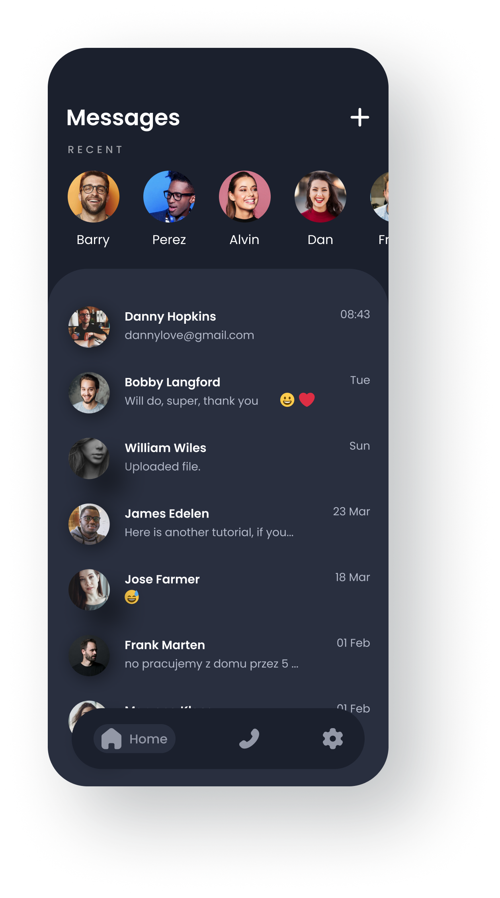
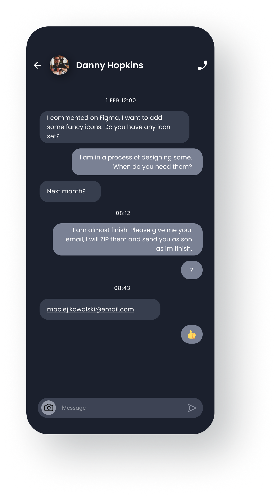
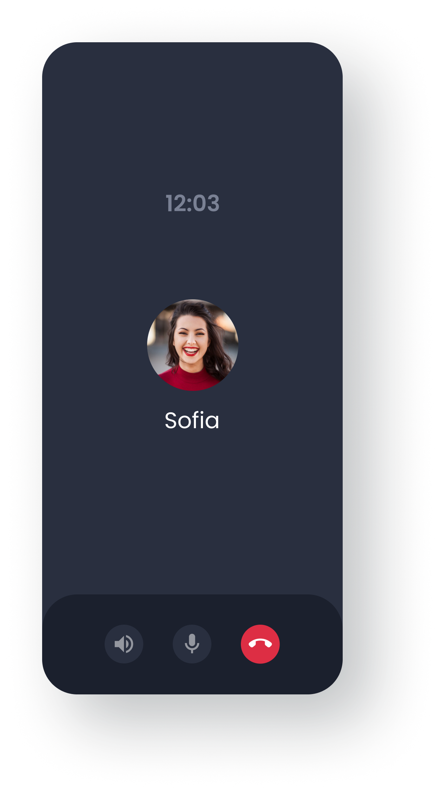

# Kotlin Messaging App

## Description
This is a real-time messaging application built with Kotlin. It provides a seamless and secure communication platform for users to exchange messages in real-time.

## Features

- Real-time messaging: Instantly exchange messages with other users.
- User Authentication: Securely authenticate users to ensure a safe messaging environment.
- Calls: Make and receive calls from other users.
- Notifications: Receive real-time notifications for new messages and updates.

## Screenshots

## Technologies Used

- Kotlin: The primary programming language for Android app development.
- Firebase: Utilized for Firestore database, user authentication.

## Installation

1. Clone the repository: `git clone https://github.com/yourusername/your-messaging-app.git`

## Usage

1. Launch the app.
2. Sign up or log in.
3. Explore the messaging features.
4. Enjoy real-time communication with other users.

## Contributing

Contributions are welcome! If you'd like to contribute to the project, please follow these steps:

1. Fork the project.
2. Create a new branch: `git checkout -b feature/your-feature-name`
3. Commit your changes: `git commit -m 'Add some feature'`
4. Push to the branch: `git push origin feature/your-feature-name`
5. Submit a pull request.

## Contact

Bemba mahmouden
bambamedsalem@gmail.com
https://dev.bembamahmouden.com
---
